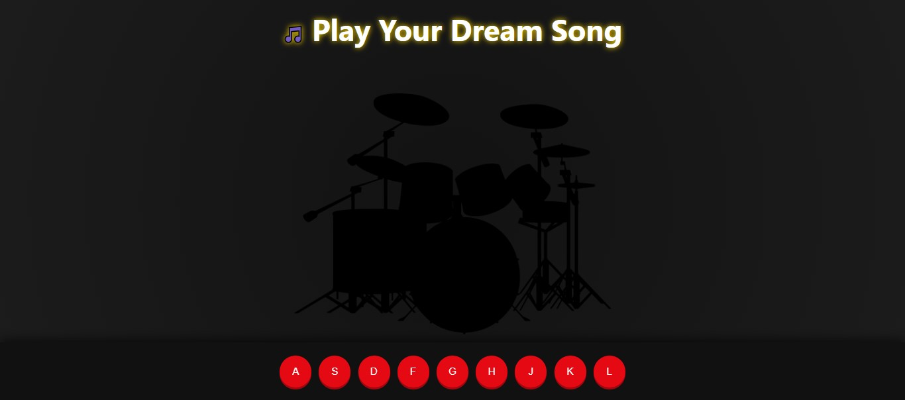

# 🥁 Drum Kit Projesi

HTML, CSS ve JavaScript kullanılarak hazırlanmış basit bir davul çalma uygulamasıdır.

## Özellikler
- Klavyeden A-L tuşlarıyla davul sesleri çalınabilir.
- Tuşlara tıklanarak da sesler tetiklenebilir.
- Her tuşa özel bir ses atanmıştır.
- Butonlara animasyon ve renk efekti eklenmiştir.

## Kullanılan Teknolojiler
- HTML
- CSS
- JavaScript
## Ekran Görüntüsü

