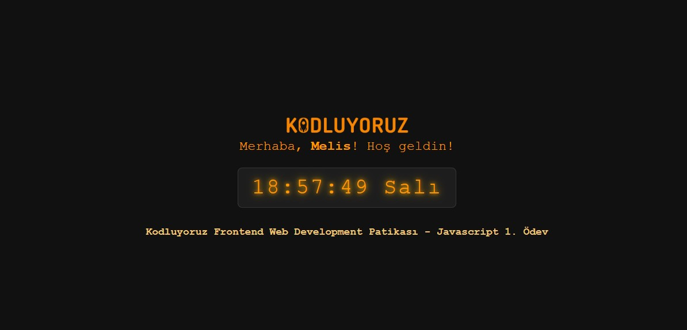

# 🕒 Dijital Saat Uygulaması

Bu proje, **Kodluyoruz Frontend Web Development Patikası** kapsamında hazırlanan **JavaScript 1. Ödevi**dir.  
Kullanıcıdan isim alır, isme özel bir karşılama metni gösterir ve ekranın ortasında **canlı dijital saat** ile birlikte gün bilgisini yansıtır.

---

## 🛠️ Kullanılan Teknolojiler

- **HTML5**  
- **CSS3**  
- **JavaScript (Vanilla)**

---

## 🎯 Özellikler

- Sayfa açıldığında kullanıcıdan ad alınır.
- Hoş geldin mesajı, girilen isme göre özelleştirilir.
- Saat ve gün bilgisi dijital bir şekilde canlı olarak gösterilir.
- Kodluyoruz logosu üstte yer alır.
- Tüm içerik sade, modern ve responsive (ekran uyumlu) tasarımla sunulur.

---

## 🖼️ Ekran Görüntüsü

>   
> Uygulamanın üst kısmında Kodluyoruz logosu yer alır. Altında kullanıcı ismiyle karşılanır ve ekranın ortasında dijital saat görünür.

